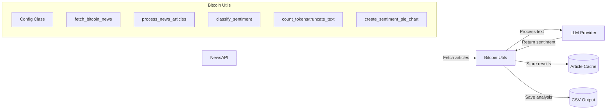

# Bitcoin News Sentiment Analysis API

## Overview

This API provides automated sentiment analysis for Bitcoin news articles. The workflow consists of three main steps:

1. **Fetch** - Retrieve Bitcoin-related news articles from NewsAPI within a specified date range
2. **Score** - Analyze sentiment of each article using an LLM (via LiteLLM)
3. **Aggregate** - Collect results, cache analyzed articles, and save to CSV

The system optimizes API token usage by caching previously analyzed articles, preventing redundant processing.

## Architecture Diagram



## Function Reference

### Configuration

```python
@dataclass
class Config:
    """Configuration settings for the application."""
    NEWS_API_KEY: str
    OPENAI_API_KEY: Optional[str]
    TOGETHER_API_KEY: Optional[str]
    GOOGLE_API_KEY: Optional[str]
    HUGGINGFACE_API_KEY: Optional[str]
    PROVIDER: str = "together_ai"
    MODEL_ID: str = "mistralai/Mixtral-8x7B-Instruct-v0.1"
    MAX_TOKENS: int = 1000
    DATA_DIR: Path = Path.cwd() / "data"
    CSV_PATH: Path = DATA_DIR / "bitcoin_news_sentiment.csv"
    CACHE_PATH: Path = DATA_DIR / "article_cache.json"
    PROMPT_TEMPLATE: str = (...)
```

**Methods:**
- `load()` - Class method to load configuration from environment variables
- `provider_configs` - Property that returns provider-specific configurations

**Design notes:** 
- Uses dataclass for cleaner syntax and automatic `__init__`, `__repr__`
- Provides defaults for optional parameters
- Centralizes all configuration in one class

### News Fetching

```python
def fetch_bitcoin_news(
    config: Config, 
    page_size: int = 10, 
    days_back: int = 1, 
    custom_from_date: str = None, 
    custom_to_date: str = None
) -> List[Dict]
```

**Parameters:**
- `config`: Configuration object with API keys
- `page_size`: Number of articles to fetch (default: 10)
- `days_back`: Number of days in the past to fetch articles from (default: 1)
- `custom_from_date`: Optional specific start date in YYYY-MM-DD format
- `custom_to_date`: Optional specific end date in YYYY-MM-DD format

**Returns:**
- List of article dictionaries with fields:
  - `title`: Article headline
  - `description`: Article content or description
  - `url`: Link to full article
  - `publishedAt`: Publication date/time

**Design notes:**
- Uses NewsAPI's 'everything' endpoint for comprehensive results
- Allows flexible date range specification
- Handles date formatting automatically

### Sentiment Analysis

```python
def classify_sentiment(text: str, config: Config) -> Tuple[str, float]
```

**Parameters:**
- `text`: The article text to analyze
- `config`: Configuration object with provider settings

**Returns:**
- Tuple containing:
  - Sentiment classification (string): "Positive", "Neutral", or "Negative"
  - Cost of the API call (float)

**Design notes:**
- Uses truncation to fit within token limits (saves on API costs)
- Implements error handling with fallback to "Neutral"
- Returns cost for tracking API usage

### Text Processing

```python
def count_tokens(text: str) -> int
```

**Parameters:**
- `text`: Text to count tokens for

**Returns:**
- Number of tokens in the text using cl100k_base encoding

```python
def truncate_text(text: str, max_tokens: int = 1000) -> str
```

**Parameters:**
- `text`: Text to truncate
- `max_tokens`: Maximum number of tokens to keep (default: 1000)

**Returns:**
- Truncated text preserving complete sentences

**Design notes:**
- Preserves sentence boundaries when truncating
- Optimizes for token usage in LLM API calls

### Main Processing Pipeline

```python
def process_news_articles(
    config: Config, 
    page_size: int = 10, 
    days_back: int = 1, 
    custom_from_date: str = None, 
    custom_to_date: str = None
) -> pd.DataFrame
```

**Parameters:**
- `config`: Configuration object
- `page_size`: Number of articles to fetch
- `days_back`: Number of days in the past to fetch articles from
- `custom_from_date`: Optional specific start date in YYYY-MM-DD format
- `custom_to_date`: Optional specific end date in YYYY-MM-DD format

**Returns:**
- DataFrame with processed articles containing columns:
  - `publishedAt`: Publication timestamp
  - `headline`: Article headline
  - `sentiment`: Classified sentiment
  - `score`: Numerical score (-1 for negative, 0 for neutral, 1 for positive)
  - `url`: Article URL
  - `cost`: API call cost
  - `cached`: Boolean indicating if result was from cache

**Design notes:**
- Implements caching to avoid re-analyzing articles
- Provides detailed progress information
- Handles empty results gracefully
- Saves all processing results to cache

### Visualization

```python
def make_clickable(val)
```

**Parameters:**
- `val`: URL to make clickable

**Returns:**
- HTML link for displaying in dataframes

```python
def create_sentiment_pie_chart(df: pd.DataFrame) -> go.Figure
```

**Parameters:**
- `df`: DataFrame with sentiment analysis results

**Returns:**
- Plotly figure object with pie chart

**Design notes:**
- Uses color coding for sentiment categories (green for positive, gray for neutral, red for negative)
- Creates interactive visualizations for better insights

## Environment Setup

The application relies on environment variables stored in a `.env` file for API keys. Create a file named `.env` in the project root with the following format:

```
# Required
NEWS_API_KEY=your_newsapi_key

# Optional (at least one LLM provider is needed)
OPENAI_API_KEY=your_openai_key
TOGETHER_API_KEY=your_together_api_key
GOOGLE_API_KEY=your_google_key
HUGGINGFACE_API_KEY=your_huggingface_key
```

### Required API Keys:

1. **NewsAPI Key** (required): 
   - Obtain from: https://newsapi.org/
   - Free tier: 100 requests/day, limited to articles from last month

2. **LLM Provider Key** (at least one required):
   - [OpenAI API](https://openai.com/api/)
   - [Together AI](https://www.together.ai/)
   - [Google AI (Gemini)](https://ai.google.dev/)
   - [HuggingFace](https://huggingface.co/inference-api)
   - Or use Ollama for local inference (no key required)

### Default Locations:
- Cache: `./data/article_cache.json`
- Results: `./data/bitcoin_sentiment_results.csv` 